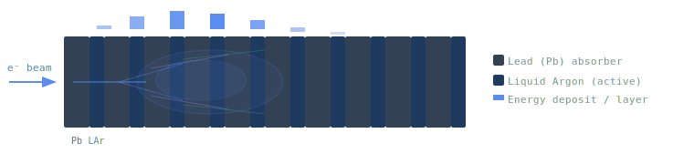

# *Objective of this project*
The goal is to demonstrate that a physics-constrained surrogate model can accurately reproduce full Geant4 shower shapes at a fraction of the computational cost, enabling real-time calorimeter reconstruction in future collider trigger systems. For this project a Physics-Informed Neural Network (PINN) is trained on Geant4 generated events reproducing the calorimeter response. The PINN uses physics considerations as constraints for the loss function.

# *Physics Background*

An electromagnetic shower develops when a high-energy photon or electron enters a dense medium. Two competing processes alternate recursively until the particle energies fall below a critical threshold $E_c$:

- *Bremsstrahlung*: electrons radiate photons as they decelerate in the nuclear Coulomb field.
- *Pair production*: photons above 1.022 MeV materialise into $e^+e^-$ pairs.

The shower grows exponentially in the first few radiation lengths $X_0$, then attenuates as individual particles dip below $E_c$ and lose enrgy mainly by ionisation.

## Longitudinal profile

The energy deposited per unit depth $t = \frac{x}{X_0}$ follows a Gamma distribution with Longo Parametrisation [[1, 2]](#references):

$$
\frac{dE}{dt} = E_0 \cdot \frac{(\beta t)^{\alpha - 1} \beta e^{-\beta t}}{\Gamma (\alpha)}
$$

where $\alpha$ and $\beta$ are shower shape and scaling parameters, $E_0$ is the beam energy and $\Gamma (\alpha)$ is the Euler Gamma function. The shower maximum grows logarithmically with energy:

$$
t_{max} = \frac{(\alpha - 1)}{\beta} = ln(\frac{E_0}{E_c}) - \frac{1}{2}
$$

here the factor $-\frac{1}{2}$ is for electrons.

## Transverse profile

Lateral spread is governed by multiple Coulomb scattering and parametrised by the Molière radius $R_M = 21 MeV \cdot \frac{X_0}{E_c}$. About 90\% of the shower energy lies within one Molière radius. The radial profile is well-described by a two component function:

$$
f(r) = 2r [p \cdot \frac{R_c^2}{(r^2 + R_c^2)^2} + (1 - p) \cdot \frac{R_t^2}{(r^2 + R_t^2)^2}]
$$

with a narrow core radius $R_c$ and a wide tail radius $R_t$, both of tthe order of $R_M$.

This analytical profiles will serve as the physics constraints for the PINN loss function. 

# *Geant4 Simulation*

For this project lets simulate a sampling calorimeter following a simplified version of ATLAS LAr calorimeter geometry. Our sampling calorimeter is built alternating layers of lead absorber and liquid argon (LAr) active medium and we will start with 20 layers.



# Docker build

The repository includes a Docker setup that installs the prebuilt conda-forge
Geant4 11.3.2 package, checks that it has HDF5 support, and then builds this
simulation against it. This avoids relying on a local Geant4 installation and
is much faster than compiling Geant4 from source.

Build the image from the repository root:

```sh
docker build -t pinn-calorimeter-geant4 .
```

The image defaults to `linux/amd64` because conda-forge provides Geant4 for
that Linux platform. On Apple Silicon Docker will run it through emulation,
which is still much faster than compiling Geant4 locally from source.

Run the default macro:

```sh
mkdir -p output
docker run --rm --platform linux/amd64 -v "$PWD/output:/output" pinn-calorimeter-geant4
```

With Geant4 MT and HDF5, ntuple merging is not available, so Geant4 writes one
HDF5 file per worker thread, for example `shower_data_t0.h5`. The Docker command
copies all `shower_data*.h5` files to `./output` on the host.

To run a shell in the configured environment:

```sh
docker run --rm -it --platform linux/amd64 pinn-calorimeter-geant4 bash
```


# *References*

[1] E. Longo and I. Sestili, *Monte Carlo Calculation of Photon-Initiated 
Electromagnetic Showers in Lead Glass*, Nucl. Instrum. Methods **128**, 283 (1975).  
https://doi.org/10.1016/0029-554X(75)90679-5

[2] G. Grindhammer et al., *The Parameterized Simulation of Electromagnetic 
Showers*, arXiv:[hep-ex/0001020](https://arxiv.org/abs/hep-ex/0001020) (2000).
